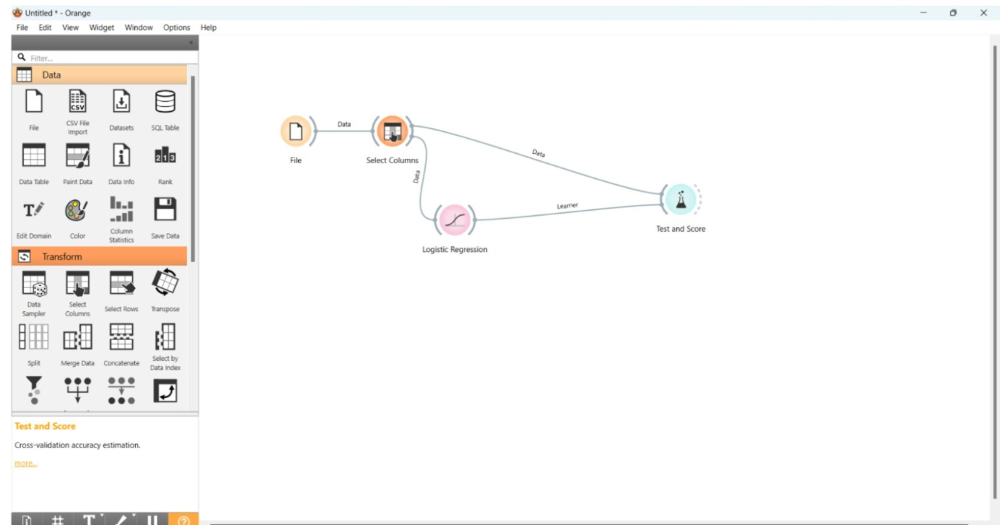

# Orange Data Mining - Logistic Regression

## Objective

To build a Logistic Regression model using Orange Data Mining and predict loan approval outcomes based on applicant financial information.

## Dataset Description

The dataset contains 100 loan applications with financial and demographic attributes used for loan approval prediction.

### Dataset Features

| Column | Description |
|----------|------------|
| Applicant_ID | Unique applicant ID |
| Age | Applicant age |
| Gender | Male/Female |
| Income | Monthly income |
| Employment_Years | Work experience |
| Credit_Score | Creditworthiness score |
| Existing_Loan | Existing loan amount |
| Debt_to_Income_Ratio | Debt burden percentage |
| Property_Owned | Yes/No |
| Loan_Status | Approved/Rejected (Target Variable) |

## Orange Workflow

The dataset was imported into Orange Data Mining and processed using Logistic Regression for classification and prediction.

## Steps Performed

1. Imported dataset into Orange.
2. Connected Data Table widget for data inspection.
3. Applied Logistic Regression model.
4. Evaluated model using Test & Score.
5. Analyzed predictions and model performance.

## Learning Outcome

- Understanding classification models.
- Building machine learning workflows without coding.
- Evaluating predictive performance.
- Applying Logistic Regression to financial decision-making.

- # Author

**Shravya Jindal**

MBA Finance

AI, Automation, Analytics & Business Intelligence Projects

---
